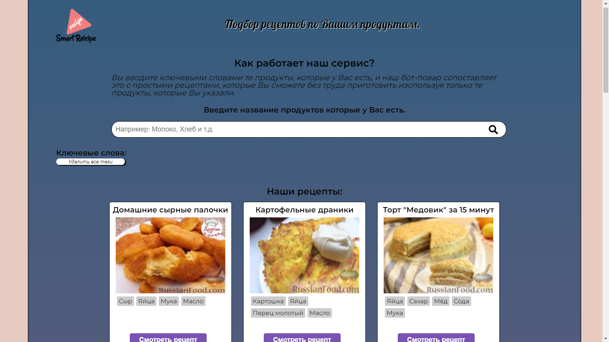
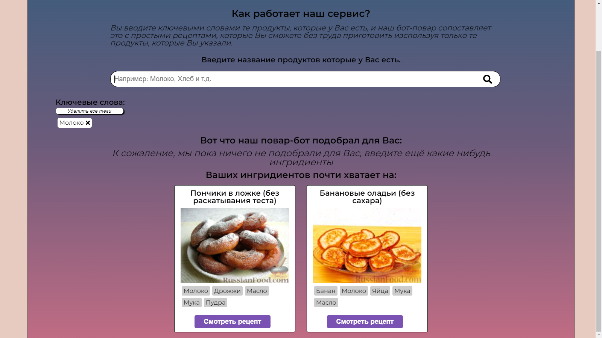
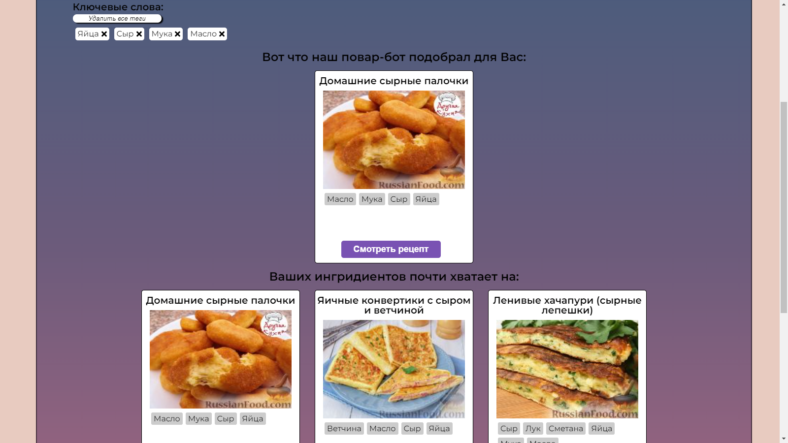
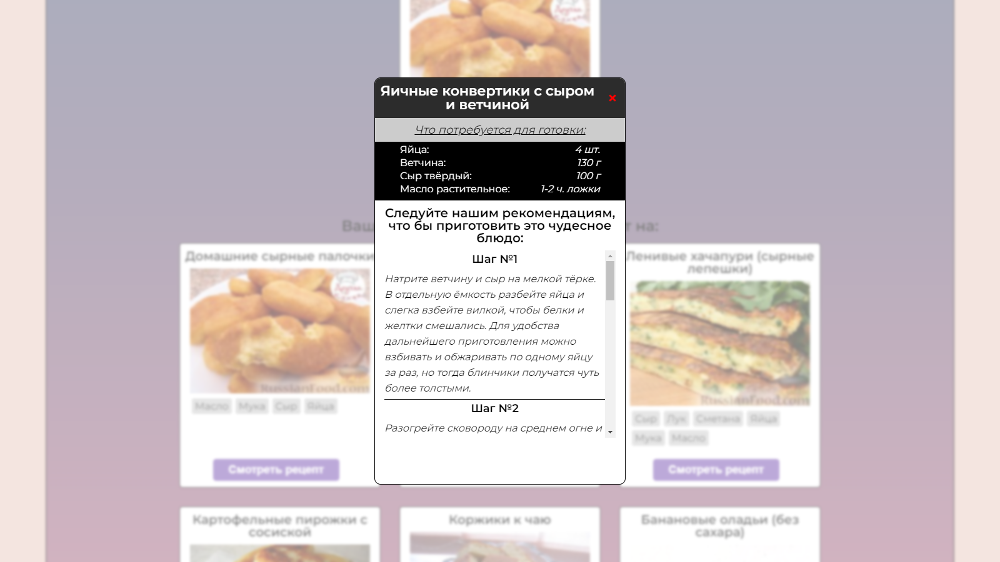

# Smart Recipe

Идея приложения - поиск блюд по тем продуктам, что есть в начилии.

## _Главный экран_

На главном экране представлено краткое описание, для чего нужно это приложение, как им пользоваться и какие рецепты представлены на странице.

____

## _Инпут_

При вводе продуктов, которые имеются в налачии, они будут попадать в список тегов, из которых будет производиться поиск. Будут искаться те блюда, на которые почти хватает продуктов, а так же, которые можно приготовить из переданных в список продуктов.

____

## _Рецепт_

При нажатии на кнопку __Смотреть рецепт__ появляется всплывающее окно, где кратно описанные ингридиенты и их кол-во, а так же кратное описание как приготовить данное блюдо.

____

Приложение написанно на: React, SCSS